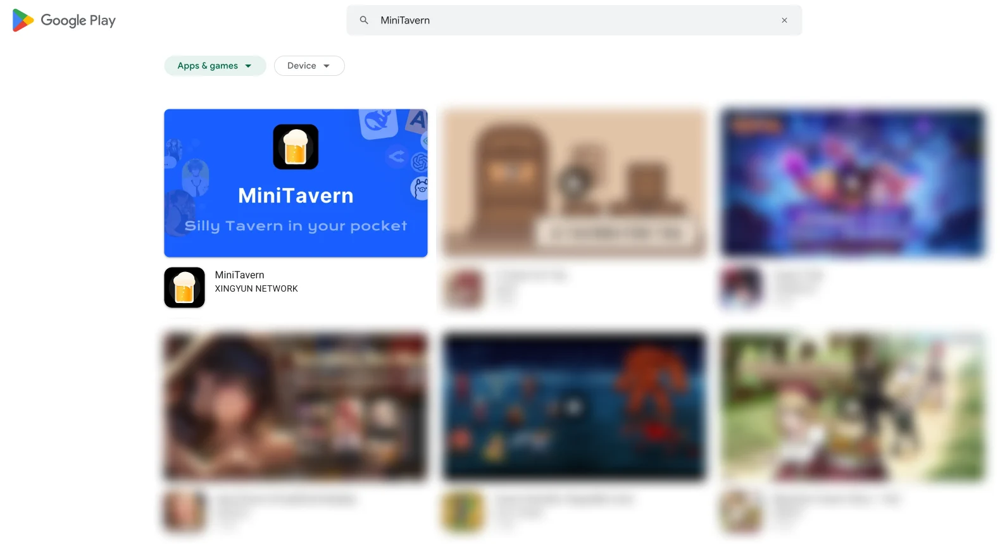

# MiniTavern Android Client · Best Silly Tavern Alternative | ST Android | Tavern AI | SFW Chatbot | Silly Tavern iOS Android Mobile

[日本語](./README_jp.md) | [简体中文](./README_zh-hans.md) | [繁體中文](./README_zh-hant.md) | [Русский](./README_ru.md)

**MiniTavern** is a free, mobile-optimized companion app designed for fans of **SillyTavern**.  
It brings immersive AI role-playing and character chat to Android — anytime, anywhere, without a PC, complex setup, or technical barriers.

## Download & Update Channels

- **Google Play (Primary / Recommended):**  
  [https://play.google.com/store/search?q=MiniTavern&c=apps&hl=en](https://play.google.com/store/search?q=MiniTavern&c=apps&hl=en)

- **Official GitHub Tracking Releases (When Play review timing lags):**  
  [https://github.com/minitavern/MiniTavern_Android/releases](https://github.com/minitavern/MiniTavern_Android/releases)

> **Update policy:** Google Play remains the long-term official install/update path.  
> When store review timing is delayed, we keep the latest available Android build in sync through official GitHub Tracking Releases.

Whether you're into deep role-play, dating conversation practice, language learning through immersive chats, or emotional companionship with AI characters, MiniTavern provides a smooth mobile-first experience.

## Key Features

- **Full SillyTavern Character Card Support**  
  Import `.png` / `.json` character cards from SillyTavern (including samples, shared cards, image cards, and URL cards).

- **Broad AI Model Compatibility**  
  Works with providers such as:
  - OpenAI (ChatGPT)
  - Anthropic (Claude)
  - Google Gemini
  - xAI Grok
  - DeepSeek
  - OpenRouter
  - Ollama (local models)
  - Other OpenAI-compatible endpoints

- **Mobile-First Design**  
  Clean and touch-friendly interface built for phones.

- **Privacy-Focused Local Storage**  
  Character cards, API keys, chat history, and settings are stored on your device.

- **Free Core Experience**  
  Basic chatting, character import, and BYO API key workflow are available without a core paywall.

- **Offline-Capable Usage**  
  Use local-model endpoints (e.g., Ollama-compatible setups) for private, local-first chats.

## Why MiniTavern on Android?

Traditional SillyTavern workflows are powerful but desktop-oriented and often require technical setup.  
MiniTavern removes those barriers: no rooting, no Termux, no Linux emulators, no port forwarding.

Install, import a character (or use samples), connect your API (or use available free quotas), and start chatting.

**Official Website:** [https://mini-tavern.com](https://mini-tavern.com)

Updated Jun 1, 2026
