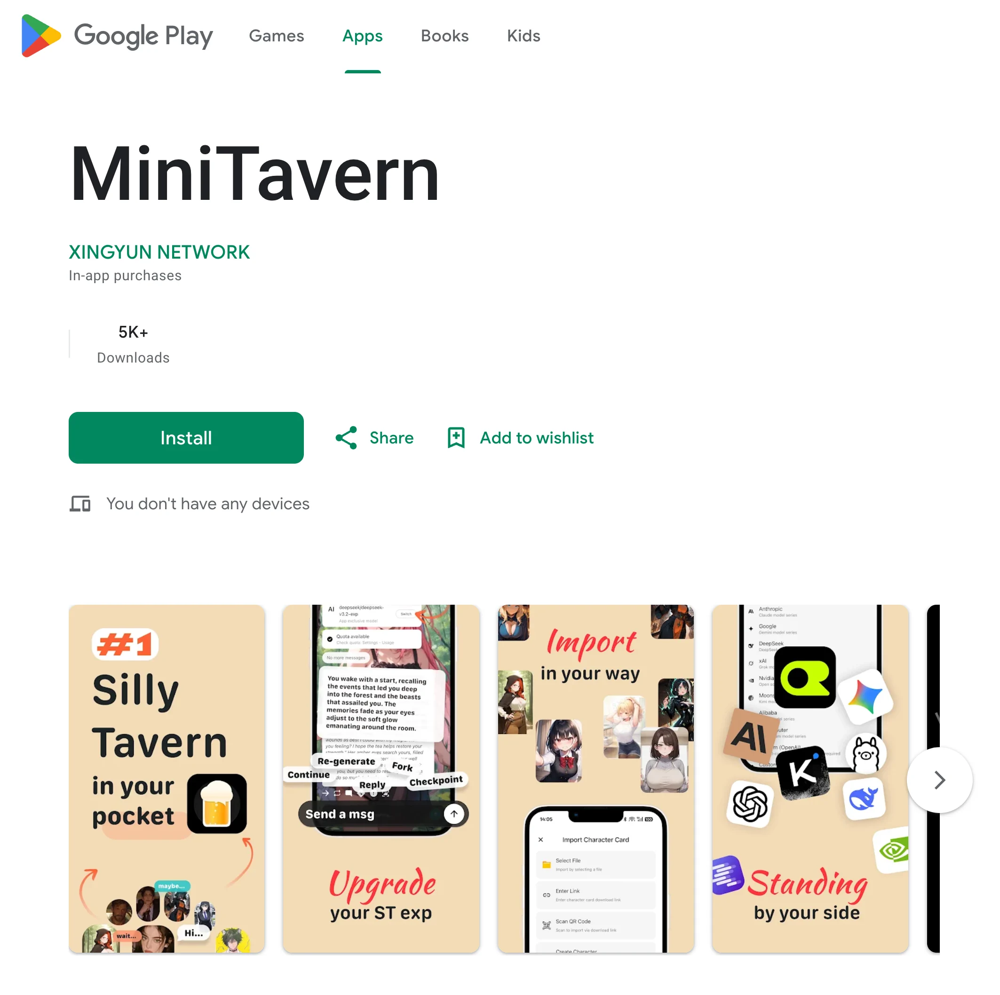
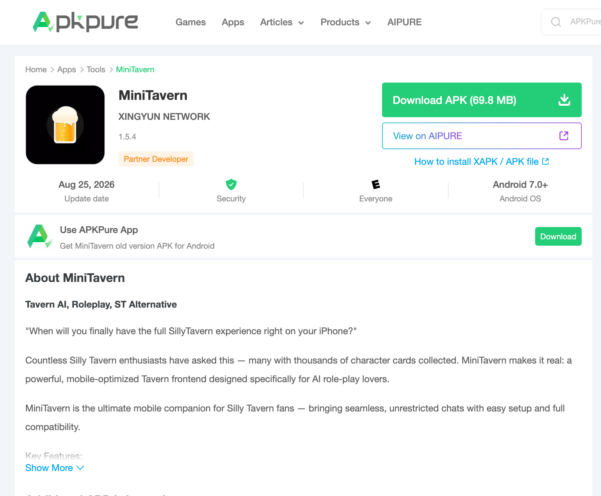

# MiniTavern Android クライアント | Silly Tavern Android | 酒館アプリ | Google Play 正式版 | GitHub 公式トラッキング | キャラクターカード | ロールプレイ | AIチャット

<time datetime="2026-08-27">2026 年 8 月 27 日 更新</time> · Android v1.5.4

[English](./README.md) | [简体中文](./README_zh-hans.md) | [繁體中文](./README_zh-hant.md) | [Русский](./README_ru.md)

**MiniTavern** は、**SillyTavern** ファンのために設計された、無料のモバイル最適化コンパニオンアプリです。  
あなたが愛する没入型 AI ロールプレイとキャラクターチャットの体験を、Android スマートフォンに直接届けます——いつでもどこでも、パソコンや複雑なセットアップ、専門知識は一切不要です。

OpenAI、Anthropic（Claude）、Google Gemini、DeepSeek、Kimi、SpaceXAI などの主要サービスに接続できます。会員向けの専用モデルは継続的にアップグレードされます。OpenRouter のほか、Ollama / KoboldCpp / LM Studio によるローカルモデルにも対応しています。

## ダウンロードと更新導線

- **Google Play（正式・推奨）**  
  [https://play.google.com/store/apps/details?id=com.kongyouwangluo.minitavern](https://play.google.com/store/apps/details?id=com.kongyouwangluo.minitavern)

  

- **APKPure（Google Play が使えない場合）**  
  [https://apkpure.com/minitavern/com.kongyouwangluo.minitavern](https://apkpure.com/minitavern/com.kongyouwangluo.minitavern)

  

- **公式 GitHub トラッキング版（ストア審査に時間差がある場合）**  
  [https://github.com/minitavern/MiniTavern_Android/releases](https://github.com/minitavern/MiniTavern_Android/releases)

> **更新方針：** 長期的なインストールと更新は **Google Play** を主導線とします。  
> Google Play が使えない場合は APKPure をご利用ください。  
> ストア審査に時間差がある場合のみ、公式 GitHub トラッキング版で最新の利用可能ビルドを同期します。

深いロールプレイ、デートの会話練習、没入型チャットによる語学学習、あるいは AI キャラクターとの心の交流——どんな目的にも、MiniTavern はスムーズで楽しいモバイル体験を提供します。

## 最近の主な更新

- **v1.5.4（現行）：** ストリーミング有効時にチャットが使えなくなる問題を修正。キャラクターカードと履歴の書き出し、別端末への取り込みを復旧。[リリースノート](https://mini-tavern.com/blog/ja/silly-tavern-app/minitavern-android-v1-5-4-update)
- **v1.5.2 / v1.5.3：** 会員向け「随想」（端末内メモ。会員 AI が随想を踏まえて返信し、アプリ内クレジットは消費しません）；会話チェックポイント（履歴付き PNG を書き出し）；チャット中のカード編集が即時反映され履歴を保持；マルチモーダル対応モデルでの画像送信。[リリースノート](https://mini-tavern.com/blog/ja/silly-tavern-app/minitavern-v1-5-3-ios-android-update)
- **v1.5.0 / v1.5.1：** グローバルなモデル設定（カードごとのモデル層を廃止）；Kimi / OpenRouter の専用入口；KoboldCpp / LM Studio を OpenAI プロトコルで接続；会員モデルを GPT-5.5 と Claude Fable 5 にアップグレード；チャット画面でのモデル切り替えを高速化。[リリースノート](https://mini-tavern.com/blog/ja/silly-tavern-app/minitavern-v1-5-1-ios-android-update)

## 主な機能

- **SillyTavern キャラクターカードの完全サポート**  
  SillyTavern の .png または .json キャラクターカードを簡単にインポートできます（内蔵サンプル、コミュニティ共有、画像/URL サポートを含む）。

- **幅広い AI サービスへの対応**  
  主要なプロバイダーに接続可能：  
  - OpenAI  
  - Anthropic（Claude）  
  - Google Gemini  
  - DeepSeek  
  - Kimi  
  - SpaceXAI  
  - Nvidia  
  - OpenRouter（複数モデルのゲートウェイ）  
  - Ollama、KoboldCpp、LM Studio（ローカルモデル）  
  - その他 OpenAI 互換エンドポイント

- **モバイルファーストデザイン**  
  タッチスクリーン向けにゼロから設計されたクリーンで直感的なインターフェース——デスクトップの使いにくさや小さな文字とは無縁です。

- **プライバシー重視・ローカルストレージ**  
  キャラクターカード、API キー、チャット履歴、設定はすべて**デバイス上にのみ保存**されます。  
  サーバーへのアップロードは一切ありません。アプリをアンインストールするとすべてのデータが削除されます。

- **コア体験は完全無料**  
  基本的なチャット、キャラクターのインポート、独自の API キーの使用に料金はかかりません。

- **オフライン対応**  
  ローカルモデル（Ollama、KoboldCpp、LM Studio）を使用することで、完全にプライベートでインターネット不要なチャットが可能です。

## なぜ Android で MiniTavern なのか？

従来の SillyTavern はデスクトップ向けで強力ですが、多くの場合、技術的な設定が必要です。  
MiniTavern はそのハードルを取り除きます——ルート化不要、Termux 不要、Linux エミュレーター不要、ポートフォワーディング不要。  
インストールして、キャラクターをインポート（またはサンプルを使用）し、API キーを入力（または無料枠を使用）するだけで、チャットを始められます。

Google Play を主導線として利用する場合は、通常どおりストア更新で問題ありません。  
Google Play が使えない場合は、上記 APKPure をご利用ください。  
先に最新版を試したい場合は、上記 GitHub トラッキング版をご利用ください。

**公式サイト：** [https://mini-tavern.com](https://mini-tavern.com)
