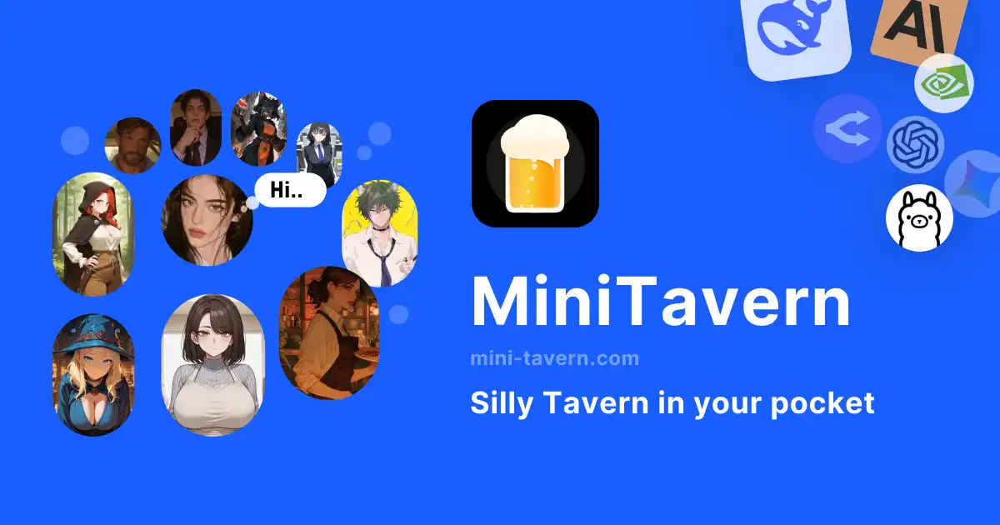

# MiniTavern Android клиент

**MiniTavern** — бесплатное мобильное приложение, созданное специально для поклонников **SillyTavern**.  
Оно переносит захватывающий опыт ролевых игр с ИИ и общения с персонажами прямо на ваш Android-смартфон — в любое время и в любом месте, без компьютера, сложных настроек и технических знаний.

[English](./README.md) | [日本語](./README_jp.md) | [简体中文](./README_zh-hans.md) | [繁體中文](./README_zh-hant.md)

**Скачайте через страницу Releases**

Будь то глубокие ролевые игры, отработка диалогов, изучение языков через погружение или просто эмоциональное общение с ИИ-персонажами — MiniTavern обеспечит плавный и приятный мобильный опыт.

## Ключевые возможности

- **Полная поддержка карточек персонажей SillyTavern**  
  Легко импортируйте карточки персонажей в формате .png или .json из SillyTavern (включая встроенные примеры, материалы сообщества, а также карточки из изображений и URL).

- **Совместимость с широким спектром ИИ-моделей**  
  Подключайтесь к ведущим провайдерам:  
  - OpenAI (ChatGPT)  
  - Anthropic (Claude)  
  - Google Gemini  
  - xAI Grok  
  - DeepSeek  
  - OpenRouter  
  - Ollama (локальные модели)  
  - и другие конечные точки, совместимые с OpenAI

- **Дизайн для мобильных устройств**  
  Чистый и интуитивный интерфейс, созданный с нуля для сенсорных экранов — без неудобств десктопной версии и мелкого шрифта.

- **Конфиденциальность и локальное хранение данных**  
  Ваши карточки персонажей, API-ключи, история чатов и настройки хранятся **только на вашем устройстве**.  
  Ничего не передаётся на наши серверы. После удаления приложения все данные уничтожаются.

- **Полностью бесплатный базовый функционал**  
  Базовый чат, импорт персонажей и использование собственных API-ключей — без каких-либо платежей.

- **Поддержка офлайн-режима**  
  Использование локальных моделей (через совместимые с Ollama конечные точки) позволяет общаться полностью приватно, без подключения к интернету.

## Почему MiniTavern на Android?

Традиционный SillyTavern мощный, но ориентирован на ПК и зачастую требует технической настройки.  
MiniTavern устраняет эти барьеры — никакого root, никакого Termux, никаких эмуляторов Linux, никакого проброса портов.  
Просто установите приложение, импортируйте персонажа (или используйте встроенные примеры), добавьте API-ключ (или воспользуйтесь бесплатными квотами) — и начинайте общаться.

## Важное уведомление о распространении

В связи с нерешёнными проблемами с проверкой в Google Play мы временно распространяем Android-клиент через альтернативные каналы.  
Как только официальная версия пройдёт проверку Google Play и будет опубликована там, эта версия для сайдлоадинга будет снята с распространения.  
Благодарим за понимание — мы активно работаем над полноценным размещением в Play Store.

Скачайте прямо сейчас и наслаждайтесь мобильным опытом SillyTavern!

**Официальный сайт:** [https://mini-tavern.com](https://app.mini-tavern.com/nPqv/suc2ty9o)

Обновлено 23 апреля 2026 г.
MiniTavern Android версия 1.4.5
